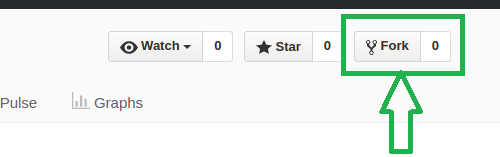
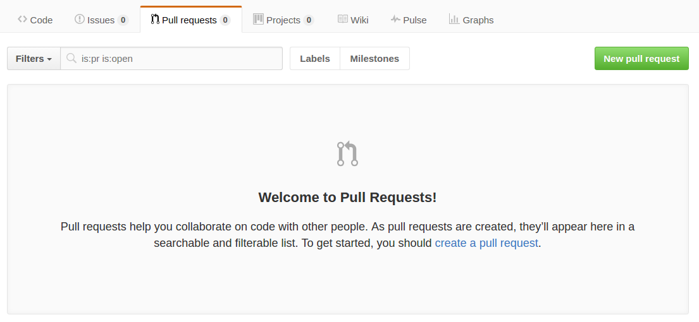

Welcome on SI-I TP1
===================

If you are a student at the HEIA-FR and you follow the SI-I course, you have come to the right place !

This is a tiny tutorial explaining how to make a pull request on a Github repo. Just follow the steps and feel free to ask any questions you have to the handsome guy standing in front of the classroom.

Tutorial
--------

First you need to install [Git](https://git-scm.com/) on your computer and to create a Github account.

Then from here, you have to fork this repo. Just click on the top right "Fork" button. This will create a copy of the repo in your account.

Clone the repo in your local machine by typing the following command : 

    git clone https://github.com/[your username here]/si-2017-tp1.git

The command will create a folder containing the files. Enter this folder (eg. `cd si-2017-tp1`).

You can see that the repo contains two branches. The branch "master" and the branch "develop". All the changes must be done on the second one ! So first go to the branch "develop" :

    git checkout develop

You can type `git branch` anytime to list all the branches you have on your local repo.

Now let's assume you want to make some changes on the project (eg. correcting something, adding a feature, resolving an issue). For this you have to create a brand new branch that will host your changes, for example "new-feature".

    git checkout -b new-feature

That command creates a branch and moves the HEAD to it. You can do it in two commands too if you prefer: `git branch new-feature` and `git checkout new-feature`.

It's time to code ! Make some changes on a file, add a new one or do whatever you want (like correcting this eerroorr). Then commit your changes and push them to Github.

    git add .
    git commit -m "The commit that will change the world forever."
    git push origin new-feature

The last command will upload your commit to Github, creating a branch "new-feature" at the same time.

The last thing to do is to create the Pull Request (or PR) on the original repo. The goal is that your modifications will be live in the original code. This step will be done on Github interface directly. Go to the your fork, it's called the *origin* (while the original repository is called the *upstream*).

Then go to the "Pull requests" tab, click on the "New pull request" green button. You'll reach a comparing changes interface where you have to select the correct branches. Remember you want to send your "new-feature" branch to the "develop" branch of the upstream. When it's ok, click on "Create pull request". Fill in the title of your PR and explain what you did in the comment section. Validate. Aaaand it's done !

**Congratulations, you've just created your first PR !**

------

Additional information
----------------------

### Markdown

This file you're currently reading is written in [Markdown](https://guides.github.com/features/mastering-markdown), it's a "lightweight and easy-to-use syntax for styling all forms of writing on the GitHub platform". You can use it in the description of PRs, issues and other comment sections. To allow Github to render your Markdown on your repo, simply name your file "README.md".

### Git

You want more or different explanations on how to use Git ?

- Github provides learning resources [here](https://help.github.com/categories/bootcamp/).
- Atlassian provides a comprehensive documentation [here](https://www.atlassian.com/git/tutorials/setting-up-a-repository).

In case you face merge conflicts, here is a [guide](https://git-scm.com/book/en/v2/Git-Tools-Advanced-Merging#Merge-Conflicts) to help you resolve them.

Branch management can be puzzling, so if you want to follow a "good practice", go check [git-flow](http://nvie.com/posts/a-successful-git-branching-model/) (install & cheatsheet [in French](http://danielkummer.github.io/git-flow-cheatsheet/index.fr_FR.html) or [in English](http://danielkummer.github.io/git-flow-cheatsheet/index.html)).

### GUI clients

You can use Git with the command line, but there are also GUI clients if you prefer. Here are some of them :

- [Github Desktop](https://desktop.github.com/) (Free, Windows+Mac)
- [SourceTree](https://www.sourcetreeapp.com/) (Free, Windows+Mac)
- [GitKraken](https://www.gitkraken.com/) (Free, Windows+Mac+Linux)

In addition to that, most IDEs have a Git plugin already installed (eg. Eclipse, IntelliJ, Visual Studio).

### Interesting readings

- [The Impact Github is Having on Your Software Career, Right Now...](https://medium.com/@sitapati/the-impact-github-is-having-on-your-software-career-right-now-6ce536ec0b50)
- [Open Source Guides](https://opensource.guide/)

------

Thanks for reading. 

*See you later !*
